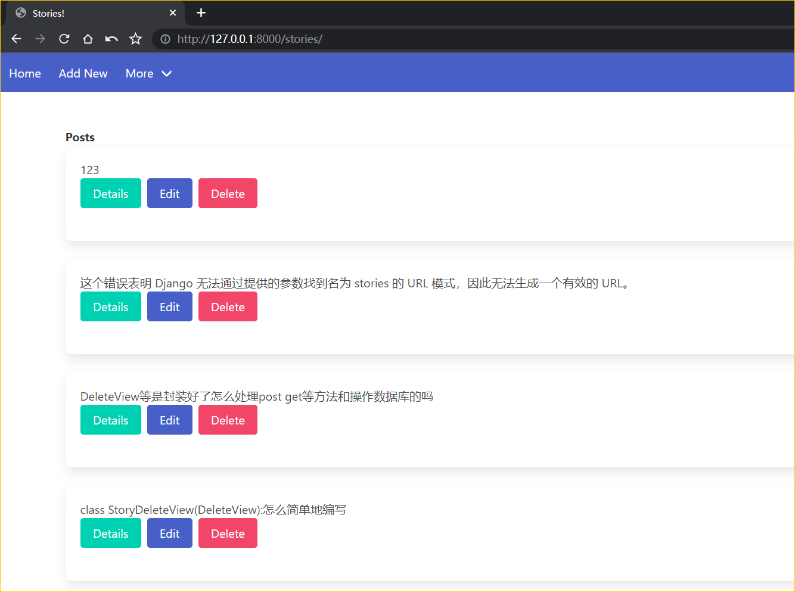
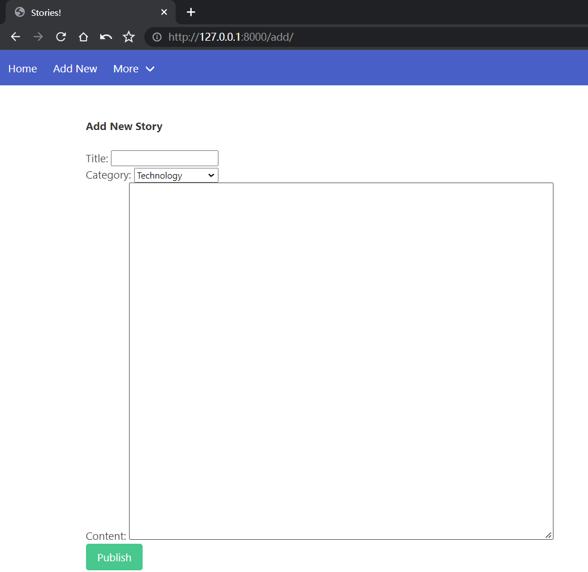
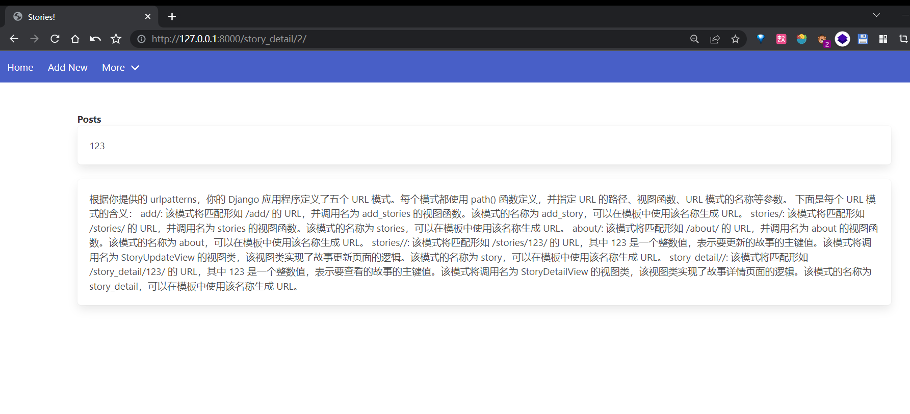
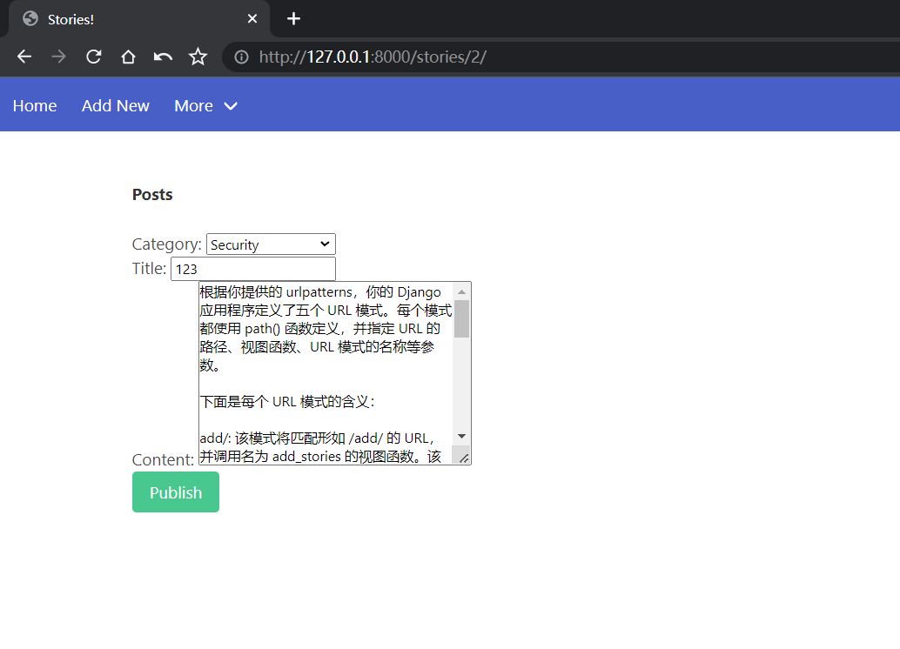
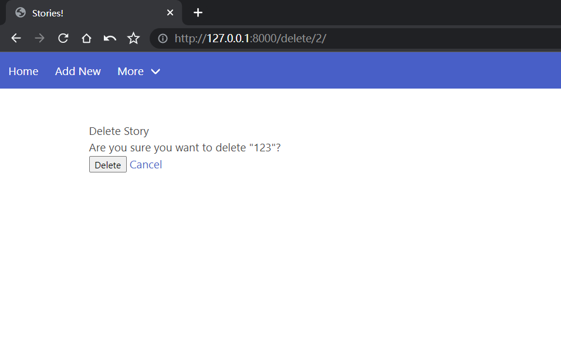
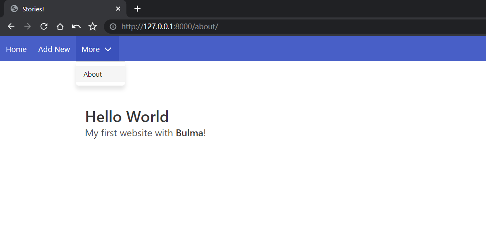

原始项目链接：[django_cms](https://github.com/essykings/django_cms)，原文链接: [How to Build a CMS With Django & Bulma CSS](https://python.plainenglish.io/how-to-build-a-cms-with-django-bulma-css-b76de3afa23f)
---
# 基于Django框架的简易内容管理系统(CMS)

## 项目描述
实现了一个具有基本的增删改查功能的CMS，前端使用Bulma CSS框架，后端使用Django框架。
### 修改内容
原项目代码存在一些问题，我纠正了bug，对用户界面进行优化，并且添加了直接增删改查的功能。项目涵盖了Django开发中涉及的一些基础知识点，适合新手学习。

## 环境
Django 4.0
Python 3.7

## 运行步骤
1. 克隆项目到本地
```
git clone https://github.com/essykings/django_cms.git
```
2. 进入项目目录
```
cd django_cms
```
3. 安装依赖
```
pip install django
```
4. 迁移数据库
```
python manage.py makemigrations
python manage.py cms
python manage.py migrate
```
5. 创建超级用户
```
python manage.py createsuperuser
```
6. 运行项目
```
python manage.py runserver
```

> 注意：需要登录超级用户后才能正常运行项目，程序并没有对匿名用户作处理。登录地址: http://localhost:8000/admin


### 运行截图








